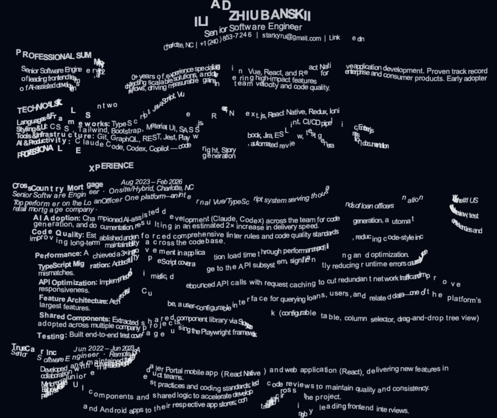

# ripple-text

Physics-driven text animation engine. Characters react to mouse and touch
interactions through expanding ripple waves and continuous field effects like
water caustics.

[Demo & homepage](https://ilia.to)



## Install

```bash
npm install ripple-text
```

## Usage

```typescript
import {
  RippleTextEngine,
  WaterField,
  WaveRipple,
  layoutText,
} from "ripple-text";

const canvas = document.getElementById("canvas") as HTMLCanvasElement;
const ctx = canvas.getContext("2d")!;

const field = new WaterField();
const ripple = new WaveRipple();

const engine = new RippleTextEngine(canvas, field, ripple, {
  bgColor: "#020814",
});

const letters = layoutText(ctx, "Hello world", { fontSize: 24, margin: 40 });
engine.setLetters(letters);
engine.start();
```

### Tuning settings at runtime

```typescript
engine.updateSettings({
  gradientForce: 25000,
  springForce: 5,
  damping: 0.92,
  maxDisplacement: 150,
});
```

### Custom colors

```typescript
const engine = new RippleTextEngine(canvas, field, ripple, {
  colorBuckets: 10,
  buildColors(n) {
    return Array.from({ length: n }, (_, i) => {
      const t = i / (n - 1);
      return `rgba(${100 + t * 155}, ${180 + t * 75}, 255, ${0.8 + t * 0.2})`;
    });
  },
});
```

### Extracting text from the DOM

```typescript
import { extractTextFromDOM } from "ripple-text";

const letters = extractTextFromDOM(document.body, 5000);
engine.setLetters(letters);
```

## API

### `RippleTextEngine(canvas, field, ripple, settings?)`

Main class. Handles physics simulation, rendering, and pointer interaction.

- **`setLetters(letters)`** — set the characters to animate
- **`updateSettings(patch)`** — update physics/rendering settings live
- **`resize(w, h)`** — call on window resize
- **`start()`** — begin the animation loop and attach event listeners
- **`stop()`** — stop the loop and remove listeners

### `layoutText(ctx, text, options)`

Lays out plain text on a canvas with word wrapping. Returns an array of letter
positions.

Options: `fontSize`, `margin`, `lineHeight`, `font`.

### `extractTextFromDOM(root, maxChars?)`

Walks the DOM tree and extracts visible characters with their screen positions
and computed fonts.

### `WaterField` / `WaveRipple`

Built-in implementations of the `FieldEffect` and `RippleSource` interfaces.
Provide your own to create custom effects.

## Settings

| Setting           | Default     | Description                                     |
| ----------------- | ----------- | ----------------------------------------------- |
| `gradientForce`   | `18000`     | How strongly field gradients push letters       |
| `springForce`     | `3.0`       | Restoration force toward original position      |
| `darkSpringBoost` | `8.0`       | Extra spring force in dark field regions        |
| `damping`         | `0.88`      | Velocity damping per frame                      |
| `maxDisplacement` | `120`       | Max pixel distance from origin                  |
| `fieldScale`      | `3`         | Field simulation downscale factor               |
| `rippleInterval`  | `90`        | Milliseconds between ripples while pointer held |
| `colorBuckets`    | `10`        | Number of displacement-based color steps        |
| `bgColor`         | `"#020814"` | Canvas background color                         |
| `showFps`         | `false`     | Show FPS counter                                |

## License

MIT
